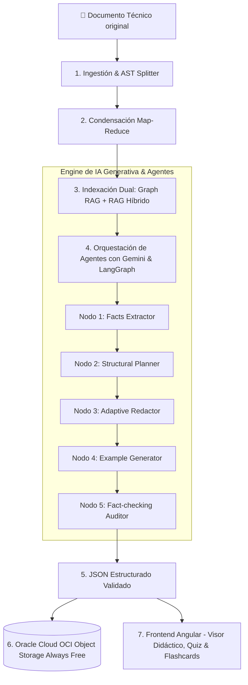

# 🎓 NuevaMente — Sistema Inteligente de Adaptación y Generación de Contenido Educativo

> **Programa ONE (Oracle Next Education) & Alura — Hackathon ONE G10**  
> *Grupo 10 | Proyecto 1: Adaptación de Contenido Técnico con IA Generativa, Graph RAG y OCI Always Free*


---

## 📄 Descripción Ejecutiva

**NuevaMente** es un sistema inteligente desarrollado para automatizar la transformación de documentaciones técnicas complejas, manuales de software, guías de arquitectura en la nube y artículos científicos en **materiales educativos hiper-personalizados** y libres de alucinaciones.

La plataforma ingiere materiales en PDF, Markdown o Texto Plano y los adapta dinámicamente según:
1. **Perfil del Destinatario:** Principiante / Transición, Desarrollador Junior/Mid, Líder Técnico / Arquitecto, Gestor / Ejecutivo.
2. **Formato Pedagógico:** Guía Paso a Paso (Tutorial), Flashcards de Memorización, Quiz Interactivo con Justificaciones, Resumen Ejecutivo (TL;DR).
3. **Nicho / Industria de Aplicación:** Fintech, Salud, E-commerce, Infraestructura en la Nube, General.

---

## 🏗️ Arquitectura de Software

La arquitectura de **NuevaMente** combina 4 tecnologías de vanguardia:



### Componentes Principales:
- **Graph RAG (Generación Aumentada por Grafos):** Mapea entidades y relaciones semánticas en un Grafo Acíclico Dirigido (DAG NetworkX) para determinar prerrequisitos y centralidad de conceptos.
- **RAG Híbrido con Re-ranking Especializado:** Búsqueda combinada Sparse (BM25) + Dense (`text-embedding-004`) reordenada por Cross-Encoder Re-ranker.
- **Procesamiento Jerárquico Map-Reduce:** Extracción paralela por secciones y síntesis libre de redundancias para documentos de más de 50 páginas.
- **Orquestación de Agentes con Google Gemini:** Grafo de 5 Nodos en LangGraph impulsado por Gemini 1.5/2.0 Pro & Flash.
- **Persistencia en OCI Object Storage Always Free:** Guardado del documento original y artefactos JSON en buckets sin generar costos.

---

## 📁 Estructura del Repositorio

```
appNuevamente/
├── backend/                       # API REST FastAPI en Python
│   ├── app/
│   │   ├── api/v1/endpoints/      # Controladores HTTP (adaptation, ingestion, storage, health)
│   │   ├── core/                  # Configuración global y credenciales
│   │   ├── schemas/               # Modelos Pydantic v2 (JSON Schema estricto)
│   │   ├── services/              # Ingestion, Hybrid RAG, Graph RAG, Agents, OCI Storage
│   │   └── infrastructure/        # Clientes de Gemini, Vector Store y OCI SDK
│   ├── tests/                     # Pruebas unitarias y de integración (pytest)
│   ├── main.py                    # Punto de entrada FastAPI
│   └── requirements.txt
├── frontend/                      # Aplicación Web Angular
│   ├── src/
│   │   ├── app/
│   │   │   ├── components/        # Sub-componentes (Uploader, ParameterConfig, ContentViewer, Flashcards, Quiz, MetadataDashboard)
│   │   │   └── core/              # Servicios REST y Modelos TypeScript
│   │   └── index.html
│   └── package.json
├── docs/                          # Documentación Técnica Detallada
│   ├── ARQUITECTURA_SOFTWARE.md   # Especificación general y diagramas C4
│   ├── PIPELINE_RAG_Y_AGENTES.md  # Teoría de Graph RAG, RAG Híbrido y LangGraph
│   └── DESPLIEGUE_OCI.md          # Guía de configuración OCI Always Free
└── README.md                      # Documentación principal
```

---

## ⚡ Instalación y Ejecución Rápida

### 1. Clonar Repositorio y Ubicar Rama
```bash
git clone https://github.com/No-Country-simulation/G10-LATAM-equipo-18-NuevaMente-Sistema-Inteligente-de-Adaptaci-n-y-Generaci-n-de-Contenido-Educativo.git
cd G10-LATAM-equipo-18-NuevaMente-Sistema-Inteligente-de-Adaptaci-n-y-Generaci-n-de-Contenido-Educativo
git checkout devbackend
```

### 2. Levantar Backend FastAPI (Python)
```bash
cd backend
python -m venv venv
# En Windows:
.\venv\Scripts\activate
# En Linux/Mac:
source venv/bin/activate

pip install -r requirements.txt

# Configurar API Key de Gemini
set GEMINI_API_KEY=tu_api_key_de_gemini

# Iniciar servidor FastAPI
python main.py
```
*El backend estará disponible en `http://localhost:8000` con documentación interactiva Swagger en `http://localhost:8000/docs`.*

### 3. Levantar Frontend Angular
```bash
cd ../frontend
npm install
npm start
```
*La aplicación web estará disponible en `http://localhost:4200`.*

---

## 📬 Ejemplo de Invocación API REST (`POST /api/v1/adapt-content`)

### Solicitud (Payload JSON):
```json
{
  "documento_titulo": "Introduccion a la Arquitectura de Redes VCN en OCI",
  "documento_contenido": "La Virtual Cloud Network (VCN) es una red privada y personalizable configurada en Oracle Cloud Infrastructure...",
  "perfil_destinatario": "Principiante",
  "formato_salida": "Flashcards",
  "nicho_sector": "General",
  "nivel_detalle": "Didactico"
}
```

### Respuesta Estructurada:
```json
{
  "status": "exito",
  "metadatos": {
    "perfil_aplicado": "Principiante",
    "formato_generado": "Flashcards",
    "tiempo_estimado_estudio_minutos": 5,
    "conceptos_clave": ["VCN", "Subredes", "Internet Gateway", "Security Lists"]
  },
  "contenido_adaptado": {
    "titulo": "Dominando Redes en la Nube (VCN) desde Cero",
    "introduccion_contextualizada": "Imagina la VCN como tu propio barrio privado dentro de Oracle Cloud...",
    "items": [
      {
        "frente": "¿Qué es una VCN en Oracle Cloud?",
        "dorso": "Es tu red virtual privada y personalizada dentro de la nube de Oracle.",
        "pista_didactica": "Piensa en ella como el terreno cercado donde residen tus servidores."
      }
    ]
  },
  "evaluacion_calidad": {
    "anclaje_fuente_score": 0.98,
    "claridad_pedagogica": "Alta",
    "observaciones": "Lenguaje ajustado con analogías para público principiante."
  },
  "almacenamiento_oci": {
    "bucket": "nuevamente-contenidos-educativos",
    "objeto_id": "contenido-vcn-principiante-flashcards-001.json",
    "status_upload": "completado"
  }
}
```

---

## 👥 Equipo y Créditos
- **Programa:** ONE (Oracle Next Education) & Alura — Hackathon G10.
- **Grupo:** Equipo 18 / Grupo 10.
