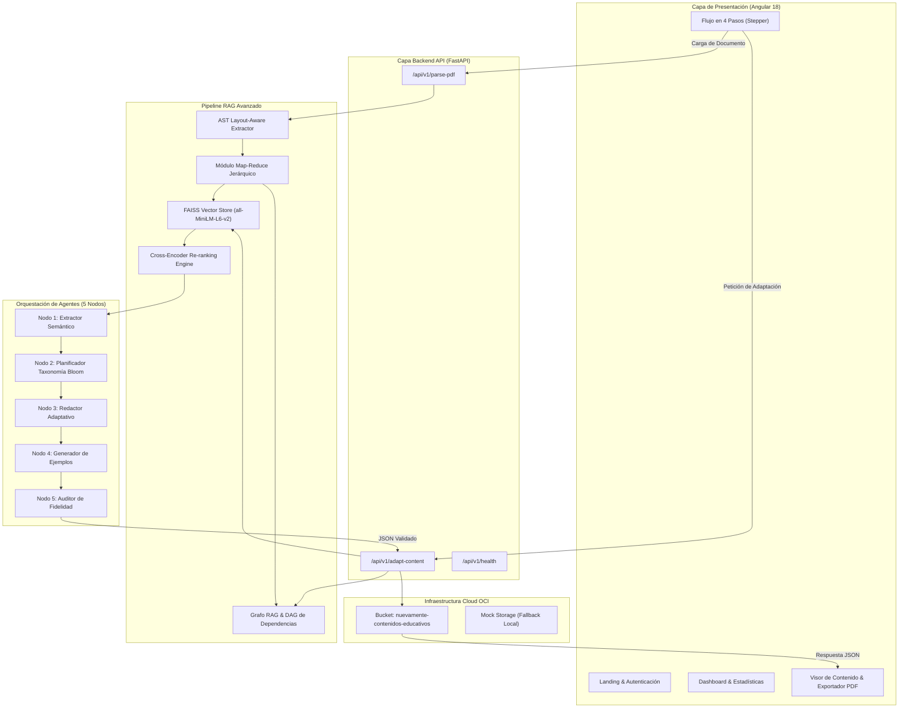
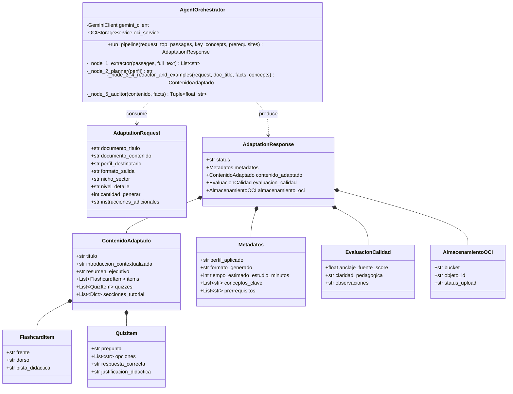

# 📘 Documentación 1: Arquitectura de Software de NuevaMente

> **Sistema Inteligente de Adaptación y Generación de Contenido Educativo**  
> *Hackathon ONE G10 — Oracle Next Education & Alura | Grupo 10*

---

## 1. Visión General de la Arquitectura

**NuevaMente** está construido siguiendo los principios de la **Arquitectura Limpia (Clean Architecture)** y la separación estricta de responsabilidades (*Separation of Concerns*). El sistema desacopla totalmente la capa de presentación SPA (Angular 18), la capa de orquestación de servicios y APIs REST (FastAPI Python), la capa de procesamiento inteligente (Graph RAG + Hybrid Vector/Lexical RAG + Agentes de IA), y la capa de almacenamiento en la nube (**Oracle Cloud Infrastructure - OCI Object Storage Always Free**).

```
┌─────────────────────────────────────────────────────────────────────────┐
│                     CAPA DE PRESENTACIÓN (FRONTEND)                     │
│    Angular 18 SPA (TypeScript + RxJS) - Dashboard, Stepper & Viewer    │
└────────────────────────────────────┬────────────────────────────────────┘
                                     │ HTTP REST / JSON
                                     ▼
┌─────────────────────────────────────────────────────────────────────────┐
│                     CAPA DE SERVICIOS REST (BACKEND)                    │
│      FastAPI (Python) - Endpoints de Ingestión, Salud y Adaptación     │
└────────────────────────────────────┬────────────────────────────────────┘
                                     │
           ┌─────────────────────────┴─────────────────────────┐
           ▼                                                   ▼
┌─────────────────────────────────────┐     ┌─────────────────────────────┐
│    ORQUESTADOR AGÉNTICO (LANGGRAPH) │     │    MOTOR RAG Y VECTOR STORE │
│  - Nodo 1: Extractor de Hechos      │     │  - Parsing Consciente (AST) │
│  - Nodo 2: Planificador Bloom       │     │  - Búsqueda Híbrida (BM25) │
│  - Nodo 3: Redactor Adaptativo      │     │  - FAISS Vector Store       │
│  - Nodo 4: Generador Ejemplos       │     │  - Graph RAG (DAG)          │
│  - Nodo 5: Auditor Fidelidad        │     │  - Cross-Encoder Re-ranker  │
└──────────────────┬──────────────────┘     └──────────────┬──────────────┘
                   │                                       │
                   ▼                                       ▼
┌─────────────────────────────────────┐     ┌─────────────────────────────┐
│      MOTOR IA GENERATIVA (LLM)      │     │     INFRAESTRUCTURA CLOUD   │
│  - Google Gemini 1.5 Pro / Flash    │     │  - OCI Object Storage       │
│  - Validación Pydantic / JSON Schema│     │  - Capa Always Free         │
└─────────────────────────────────────┘     └─────────────────────────────┘
```

---

## 2. Diagramas de Arquitectura de Software

### 2.1 Diagrama General de Flujo de Sistema (Mermaid Flowchart)



---

### 2.2 Diagrama de Clases (Mermaid Class Diagram)



---

### 2.3 Diagrama de Componentes (Mermaid Component Diagram)

```mermaid
componentDiagram
    package "Frontend (Angular SPA)" {
        [Landing / Auth Component]
        [Dashboard Component]
        [Stepper Creation Component]
        [Content Viewer Component]
        [Interactive Flashcards Component]
        [Interactive Quiz Component]
        [Metadata Dashboard Component]
        [State Service (RxJS)]
        [API Service (HttpClient)]
    }

    package "Backend (FastAPI Python)" {
        [API Router / Endpoints]
        [Agent Orchestrator Service]
        [Graph RAG Service]
        [Hybrid RAG Service]
        [Ingester Service]
        [OCI Storage Service]
        [Gemini Client / LLM Router]
    }

    package "External Cloud & AI" {
        [Google Gemini 1.5 API]
        [OCI Object Storage API]
    }

    [Stepper Creation Component] --> [API Service (HttpClient)]
    [Content Viewer Component] --> [State Service (RxJS)]
    [API Service (HttpClient)] --> [API Router / Endpoints] : REST / HTTP
    [API Router / Endpoints] --> [Agent Orchestrator Service]
    [Agent Orchestrator Service] --> [Graph RAG Service]
    [Agent Orchestrator Service] --> [Hybrid RAG Service]
    [Agent Orchestrator Service] --> [Gemini Client / LLM Router]
    [Agent Orchestrator Service] --> [OCI Storage Service]
    [Gemini Client / LLM Router] --> [Google Gemini 1.5 API] : HTTPS
    [OCI Storage Service] --> [OCI Object Storage API] : OCI SDK
```

---

## 3. Explicación Detallada de los Componentes

### 3.1 Módulo de Ingestión y Extracción (`IngesterService`)
* **Propósito:** Recibe archivos en formato **PDF, Markdown (`.md`) o Texto Plano (`.txt`)**, extrae el contenido completo preserving la sintaxis y limpia caracteres no imprimibles.
* **Procesamiento de PDF:** Utiliza extractores basados en layout (`pypdf` / `PyMuPDF4LLM`) que leen tablas, párrafos y estructuras sin destruir el orden lógico.

### 3.2 Motor de RAG Híbrido (`HybridRAGService`)
* **Segmentación (Chunking):** Aplica *Header-Aware Chunking* (400 - 800 tokens con overlap de 10-15%).
* **Búsqueda Vectorial Densidad:** Genera vectores de 384 dimensiones mediante `sentence-transformers/all-MiniLM-L6-v2` almacenados en un índice de memoria **FAISS (CPU)**.
* **Búsqueda Léxica Dispersa (BM25):** Indexa términos técnicos exactos, acrónimos y nombres de métodos.
* **Re-ranking:** Fusiona los resultados con *Reciprocal Rank Fusion (RRF)* y los reordena mediante Cross-Encoder antes de enviarlos a la ventana de contexto.

### 3.3 Motor Graph RAG (`GraphRAGService`)
* **Mapa de Dependencias:** Construye un Grafo Acíclico Dirigido (DAG) donde cada nodo representa un concepto y cada arista la relación instruccional.
* **Mapeo con Taxonomía de Bloom:** Evalúa el perfil del estudiante (Principiante $\rightarrow$ Recordar/Comprender; Desarrollador $\rightarrow$ Aplicar/Analizar; Arquitecto $\rightarrow$ Evaluar/Diseñar; Ejecutivo $\rightarrow$ Sintetizar/Impacto).

### 3.4 Orquestador Agéntico en 5 Nodos (`AgentOrchestrator`)
1. **Nodo 1 (Extractor Semántico de Hechos):** Extrae enunciados y hechos clave inmutables del texto fuente recuperado.
2. **Nodo 2 (Planificador Estructural):** Define la densidad conceptual según la Taxonomía de Bloom y el perfil.
3. **Nodo 3 (Redactor Adaptativo):** Genera la redacción principal en el tono y formato solicitado.
4. **Nodo 4 (Generador de Ejemplos):** Inyecta analogías del sector elegido (Fintech, Salud, E-commerce, General).
5. **Nodo 5 (Auditor de Fidelidad):** Compara el texto generado contra la fuente original y calcula la puntuación `anclaje_fuente_score` (0.0 a 1.0).

### 3.5 Persistencia Cloud OCI (`OCIStorageService`)
* Almacena los documentos fuente y las salidas en formato JSON estructurado en el bucket **`nuevamente-contenidos-educativos`** dentro de la capa **Always Free** de Oracle Cloud Infrastructure.

### 3.6 Frontend SPA (Angular 18)
* **Arquitectura Modular:** Componentes autocontenidos (`StepperCreation`, `ContentViewer`, `MetadataDashboard`, `InteractiveFlashcards`, `InteractiveQuiz`).
* **Exportador a PDF Profesional:** Genera PDFs ejecutivos libres de marcas de agua del navegador mediante reglas `@page { size: A4; margin: 0mm; }`.
