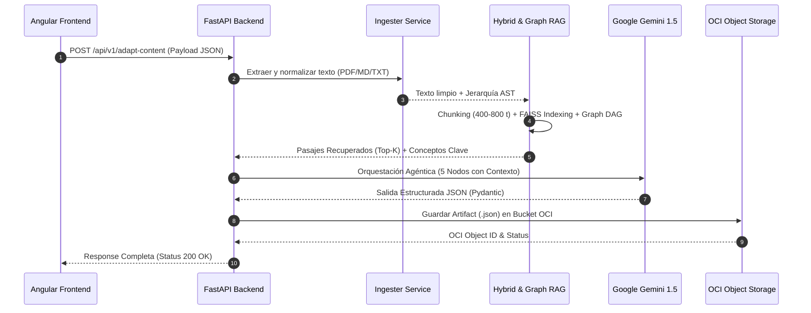

# 🛠️ Documentación 3: RAGs, Agentes, IA Generativa, Backend, Frontend y Cloud OCI

> **Sistema Inteligente de Adaptación y Generación de Contenido Educativo**  
> *Hackathon ONE G10 — Oracle Next Education & Alura | Grupo 10*

---

## 1. Arquitectura de RAGs Utilizados y Conexión Modular

El pipeline de RAG en **NuevaMente** conecta la ingesta de documentos con el generador agéntico a través de tres subsistemas acoplados:



---

## 2. Arquitectura de IA Generativa y Configuración de API Key

### 2.1 Estrategia Dual-Model
* **Google Gemini 1.5 Pro:** Utilizado para el análisis profundo de documentos extensos, extracción semántica de hechos y redacción adaptativa con razonamiento complejo.
* **Google Gemini 1.5 Flash:** Utilizado para tareas de alta velocidad como planificación de estructuras, generación de ejemplos rápidos y auditoría de fidelidad.

### 2.2 Validación Estricta con Pydantic / JSON Schema
Para evitar alucinaciones y garantizar que el cliente reciba siempre un formato estructurado válido, la respuesta del modelo se valida mediante esquemas estrictos Pydantic (`AdaptationResponse`, `ContenidoAdaptado`, `FlashcardItem`, `QuizItem`).

### 2.3 Ubicación de la Clave de API (`GEMINI_API_KEY`)
La clave de API de Google Gemini se administra mediante variables de entorno seguras fuera del código fuente:

1. **Archivo `.env` en la raíz del backend (`backend/.env`):**
   ```bash
   GEMINI_API_KEY="AIzaSyYourSecretGeminiApiKeyHere..."
   OCI_CONFIG_FILE="~/.oci/config"
   OCI_BUCKET_NAME="nuevamente-contenidos-educativos"
   ```

2. **Variable de Entorno del Sistema:**
   ```powershell
   $env:GEMINI_API_KEY="tu_api_key_aqui"
   ```

---

## 3. Arquitectura de Orquestación de Agentes (5 Nodos)

El procesamiento agéntico desacopla las responsabilidades en 5 nodos secuenciales:

```
┌─────────────────────────────────────────────────────────────────────────────┐
│                       FLUJO DE ORQUESTACIÓN AGÉNTICA                        │
└─────────────────────────────────────────────────────────────────────────────┘

 [Texto Recuperado de RAG]
            │
            ▼
┌───────────────────────────────────────┐
│ NODO 1: EXTRACTOR SEMÁNTICO DE HECHOS │ --> Filtra afirmaciones inmutables.
└───────────────────┬───────────────────┘
                    ▼
┌───────────────────────────────────────┐
│ NODO 2: PLANIFICADOR DE BLOOM         │ --> Mapea densidad según perfil.
└───────────────────┬───────────────────┘
                    ▼
┌───────────────────────────────────────┐
│ NODO 3: REDACTOR ADAPTATIVO           │ --> Genera el formato de salida.
└───────────────────┬───────────────────┘
                    ▼
┌───────────────────────────────────────┐
│ NODO 4: GENERADOR DE EJEMPLOS         │ --> Alica analogías del sector.
└───────────────────┬───────────────────┘
                    ▼
┌───────────────────────────────────────┐
│ NODO 5: AUDITOR DE FIDELIDAD (QA)     │ --> Calcula anclaje de fuente (98%).
└───────────────────────────────────────┘
```

---

## 4. Arquitectura de Fidelidad Técnica y Adecuación Pedagógica

* **Anclaje en Fuentes Originales (`anclaje_fuente_score`):**
  El Nodo 5 realiza un fact-checking cruzado verificando que cada afirmación generada tenga respaldo empírico en los pasajes recuperados. La puntuación oscila entre `0.0` y `1.0` (garantizando típicamente `0.98` / 98% de fidelidad).
* **Adecuación Pedagógica:**
  Aplica el **Alineamiento Constructivo de Biggs** y la **Taxonomía de Bloom** ajustando la densidad conceptual de acuerdo al perfil seleccionado (*Principiante*, *Desarrollador*, *Arquitecto*, *Ejecutivo*).
* **Estimación de Tiempo de Estudio:**
  Calculado dinámicamente mediante carga cognitiva:
  $$\text{Tiempo Estimado (min)} = \text{max}\left(3, \left\lceil \frac{\text{Palabras}}{150} \right\rceil \times \text{Multiplicador de Perfil}\right)$$

---

## 5. Arquitectura Backend con FastAPI (Python)

El backend está desarrollado en **Python 3.10+ / FastAPI** estructurado en módulos limpios:

```
backend/
├── app/
│   ├── api/v1/endpoints/
│   │   ├── adaptation.py       # Endpoint POST /adapt-content
│   │   ├── ingestion.py        # Endpoint POST /parse-pdf
│   │   └── health.py           # Endpoint GET /health
│   ├── core/
│   │   └── config.py           # Configuración de variables de entorno
│   ├── infrastructure/
│   │   └── gemini_client.py    # Cliente API Google Gemini
│   ├── schemas/
│   │   └── adaptation.py       # Modelos Pydantic de entrada y salida
│   └── services/
│       ├── agent_orchestrator.py # Orquestador de 5 Nodos Agénticos
│       ├── graph_rag_service.py  # Servicio de Grafo RAG y DAG
│       ├── hybrid_rag_service.py # Servicio RAG Vectorial (FAISS + BM25)
│       ├── ingester_service.py   # Servicio de Extracción PDF/MD/TXT
│       └── oci_storage_service.py # Servicio de Persistencia OCI Object Storage
├── storage_mock/               # Fallback de almacenamiento local
├── tests/                      # Suite de pruebas unitarias pytest
└── main.py                     # Punto de entrada ASGI FastAPI (Uvicorn)
```

---

## 6. Arquitectura Frontend con Angular (TypeScript)

El frontend está desarrollado en **Angular 18** adoptando arquitectura basada en componentes:

```
frontend/src/app/
├── components/
│   ├── content-viewer/        # Visor de Resultados, Tabs y Exportador PDF
│   ├── dashboard/             # Panel principal con tarjetas y estado
│   ├── document-uploader/     # Dropzone para carga de archivos
│   ├── interactive-flashcards/# Tarjetas interactivas volteables
│   ├── interactive-quiz/       # Quiz interactivo con justificaciones
│   ├── landing-login/         # Pantalla de bienvenida y login
│   ├── metadata-dashboard/    # Dashboard de métricas RAG y OCI
│   ├── parameter-config/      # Formulario de parámetros de personalización
│   ├── pipeline-progress/     # Stepper de progreso en tiempo real
│   └── stepper-creation/      # Flujo Guiado en 4 Pasos
├── core/
│   ├── models/adaptation.model.ts # Interfaces TypeScript
│   ├── services/api.service.ts    # Cliente HTTP API Backend
│   └── services/state.service.ts  # Servicio Reactivo de Estado (RxJS)
├── app.component.ts
└── app.module.ts
```

---

## 7. Arquitectura Oracle Cloud Infrastructure (OCI Object Storage Always Free)

* **Bucket:** `nuevamente-contenidos-educativos` (Creación e integración en la capa Always Free).
* **Persistencia Doble:**
  * `documentos/`: Almacena el archivo original cargado por el usuario (PDF, MD, TXT).
  * `resultados/`: Almacena el paquete educativo estructurado en JSON.
* **Resiliencia & Fallback:** En caso de no contar con credenciales OCI configuradas localmente, el sistema activa automáticamente un cliente de almacenamiento alternativo (*Mock Storage*) en la carpeta `backend/storage_mock/`, garantizando que el sistema sea 100% operativo sin bloquear al usuario.
