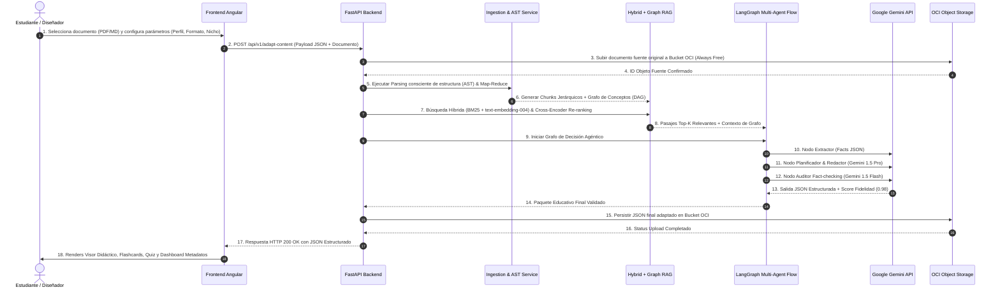
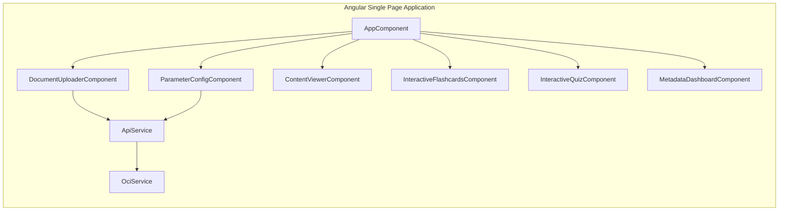

# Arquitectura de Software - Sistema NuevaMente
**Plataforma Inteligente de Adaptación y Generación de Contenido Educativo**
*Hackathon ONE G10 — Oracle Next Education & Alura*

---

## 1. Visión General del Sistema

**NuevaMente** es una plataforma de software orientada al sector EdTech y Capacitación Corporativa que automatiza la transformación de documentación técnica densa, manuales de software, especificaciones de arquitectura y artículos científicos en materiales didácticos hiper-personalizados.

El sistema recibe insumos en formato PDF, Markdown o Texto Plano y aplica una arquitectura multicapa alimentada por **Google Gemini** (1.5/2.0 Pro & Flash), **Graph RAG + RAG Híbrido** y **Orquestación Agéntica con LangGraph**, garantizando:
1. **Fidelidad Técnica Estricta:** Anclaje directo en las fuentes originales sin alucinaciones (`[Doc_X: pág Y]`).
2. **Adecuación Pedagogía Adaptativa:** Ajuste automático de tono, profundidad (Taxonomía de Bloom), analogías y formato según el perfil del estudiante (Principiante, Desarrollador, Líder Técnico, Ejecutivo).
3. **Persistencia en la Nube:** Almacenamiento seguro y gratuito de fuentes y paquetes educativos JSON en **Oracle Cloud Infrastructure (OCI) Object Storage** bajo la capa **Always Free**.

---

## 2. Arquitectura Global del Sistema (Vista de 4 Capas)

El diseño del sistema sigue el patrón de arquitectura hexagonal (puertos y adaptadores) desacoplada en cuatro capas fundamentales:

```mermaid
graph TD
    subgraph Capa 1: Presentación (Frontend Angular)
        UI[Angular 17+ SPA]
        CompUpload[Document Uploader]
        CompConfig[Parameter Selector]
        CompViewer[Adaptive Content Viewer]
        CompQuiz[Interactive Quiz Widget]
        CompCards[Flashcards Flip View]
        CompDash[Pedagogical Metadata Dashboard]
    end

    subgraph Capa 2: API & Control (Backend FastAPI)
        API[FastAPI Gateway / REST API]
        RouterAdapt[Adaptation Endpoints]
        RouterIngest[Ingestion Endpoints]
        RouterStorage[OCI Storage Endpoints]
        Schemas[Pydantic v2 Schemas]
    end

    subgraph Capa 3: Motor RAG & Agentes de IA
        subgraph Ingestión Jerárquica & AST
            DocParser[Docling / Markdown AST Splitter]
            MapReduce[Map-Reduce Processing Engine]
        end
        subgraph Indización Dual
            GraphEngine[Graph RAG / Knowledge Graph NetworkX]
            VectorEngine[Hybrid Vector Store: Gemini Embeddings + Rank-BM25]
            ReRanker[Cross-Encoder Re-ranker]
        end
        subgraph Orquestación Agéntica (LangGraph)
            NodeExtract[Node 1: Extractor Semántico]
            NodePlan[Node 2: Planificador Didáctico]
            NodeWrite[Node 3: Redactor Adaptativo]
            NodeExample[Node 4: Generador de Analogías]
            NodeAudit[Node 5: Auditor de Fact-checking]
        end
    end

    subgraph Capa 4: Infraestructura y Persistencia (OCI Always Free)
        GeminiAPI[Google Gemini API Pro/Flash]
        OCI_Bucket_Docs[OCI Bucket: nuevamente-documentos-fuente]
        OCI_Bucket_JSON[OCI Bucket: nuevamente-contenidos-educativos]
    end

    UI --> API
    API --> Schemas
    API --> DocParser
    API --> GraphEngine
    API --> VectorEngine
    API --> NodeExtract
    NodeExtract --> NodePlan --> NodeWrite --> NodeExample --> NodeAudit
    NodeWrite --> GeminiAPI
    NodeAudit --> GeminiAPI
    API --> OCI_Bucket_Docs
    API --> OCI_Bucket_JSON
```

---

## 3. Diagrama de Secuencia End-to-End

El siguiente flujo ilustra el ciclo de vida completo desde que el usuario solicita adaptar un documento técnico hasta la generación y almacenamiento del paquete didáctico final en OCI:



---

## 4. Diagramas de Componentes por Módulo

### 4.1 Componentes del Frontend (Angular 17+)
El cliente web está diseñado con componentes desacoplados, reactivos (RxJS) y compatibles con la última arquitectura de Angular:



### 4.2 Componentes del Backend (FastAPI)
El backend implementa controladores asíncronos y un modelo de inyección de dependencias modular:

```mermaid
graph TD
    subgraph FastAPI Core Engine
        Main[main.py Gateway]
        Main --> AdaptationRouter[/api/v1/adapt-content]
        Main --> IngestionRouter[/api/v1/ingest]
        Main --> StorageRouter[/api/v1/storage]

        AdaptationRouter --> AdaptationService
        IngestionRouter --> IngesterService
        StorageRouter --> OCIRepository

        AdaptationService --> HybridRAGEngine
        AdaptationService --> GraphRAGEngine
        AdaptationService --> AgentOrchestrator
        AdaptationService --> OCIRepository
    end
```

---

## 5. Diagrama de Despliegue en Infrastructure OCI (Always Free)

La solución cumple estrictamente con el presupuesto de \$0.00 del programa ONE de Oracle mediante el uso de recursos **OCI Always Free**:

```mermaid
graph TD
    subgraph Oracle Cloud Infrastructure (OCI) - Region Always Free
        subgraph Red Privada Virtual (VCN)
            subgraph Subred Pública
                VM[Instance VM Standard.A1.Flex / E2.1.Micro]
                VM --> DockerBackend[Docker Container: FastAPI App]
                VM --> DockerFrontend[Docker Container: NGINX / Angular SPA]
            end
        end

        subgraph OCI Storage Layer (Always Free)
            BucketDocs[(OCI Object Storage Bucket<br/>nuevamente-documentos-fuente)]
            BucketJSON[(OCI Object Storage Bucket<br/>nuevamente-contenidos-educativos)]
        end
    end

    DockerBackend -->|oci-sdk / REST| BucketDocs
    DockerBackend -->|oci-sdk / REST| BucketJSON
    DockerBackend -->|HTTPS API Key| GeminiCloud[Google Gemini API Cloud]
```

---

## 6. Matriz de Parámetros de Adaptación

| Perfil Destinatario | Formato Didáctico | Tono Pedagógico | Enfoque de Ejemplo |
| :--- | :--- | :--- | :--- |
| **Principiante / Transición** | Flashcards / Quiz | Accesible, metáforas cotidianas, sin acrónimos complejos | Situaciones de la vida real, intuitivo |
| **Desarrollador Jr / Semi Senior** | Guía Paso a Paso (Tutorial) | Práctico, orientado a código y comandos de terminal | Pseudocódigo, diagramas de secuencia, casos de borde |
| **Líder Técnico / Arquitecto** | Análisis Crítico / Metodológico | Riguroso, denso, especificación formal | Benchmarks, trade-offs de arquitectura, SLAs |
| **Gestor / Ejecutivo** | Resumen Ejecutivo (TL;DR) | Prescriptivo, orientado a valor e impacto | Mini casos de negocio, ROI, gestión de riesgos |
