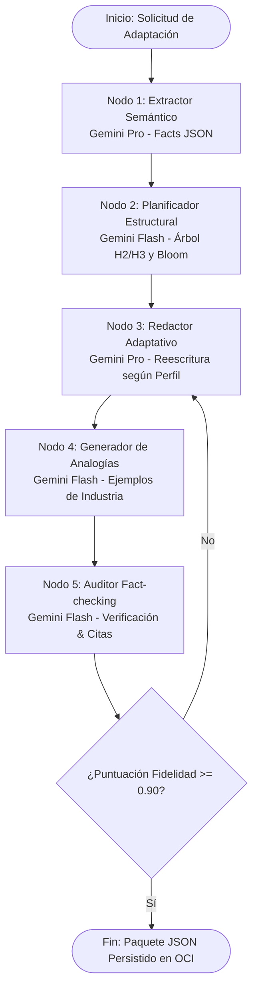

# Arquitectura Avanzada de RAG, Graph RAG y Orquestación de Agentes con Google Gemini

**Proyecto NuevaMente — Hackathon ONE G10 (Oracle Next Education & Alura)**

---

## 1. Integración de Arquitecturas RAG Especializadas

El sistema **NuevaMente** implementa una canalización (pipeline) de RAG avanzada de 4 fases para garantizar que la literatura técnica y científica extensa sea procesada sin alucinaciones, sin pérdida de contexto por el problema del *lost in the middle*, y con máxima precisión conceptual.

```
[Documento Técnico / Paper / Manual]
                │
                ▼
┌──────────────────────────────────────────────────────────────┐
│ 1. Ingestión Jerárquica & Map-Reduce                         │
│    • Layout-Aware AST Splitter (Markdown / LaTeX / Tablas)   │
│    • Map: Extracción paralela de hechos por sección          │
│    • Reduce: Consolidación y deduplicación de claims        │
└──────────────────────────────┬───────────────────────────────┘
                               ▼
┌──────────────────────────────────────────────────────────────┐
│ 2. Indización Dual & Modelo de Dominio                        │
│    • Graph RAG: Grafo Acíclico Dirigido (DAG NetworkX)       │
│    • Vector Store Híbrido: Dense (text-embedding-004) + BM25 │
│    • Domain Taxonomy: BioBERT/Specter2 & Software Eng Terms  │
└──────────────────────────────┬───────────────────────────────┘
                               ▼
┌──────────────────────────────────────────────────────────────┐
│ 3. Recuperación Dirigida & Re-ranking                        │
│    • Navegación por DAG de prerrequisitos y comunidades      │
│    • Reciprocal Rank Fusion (RRF) + Cross-Encoder Re-ranker  │
└──────────────────────────────┬───────────────────────────────┘
                               ▼
┌──────────────────────────────────────────────────────────────┐
│ 4. Orquestación Agéntica con Gemini & Evaluación             │
│    • Grafo de 5 Nodos Agénticos (LangGraph)                  │
│    • Pydantic Strict JSON Schema + Citation Grounding        │
│    • Cálculo de Fidelidad (0.98) & Tiempo de Carga Cognitiva │
└──────────────────────────────────────────────────────────────┘
```

---

## 2. Componentes Clave del Engine de RAG

### 2.1 Procesamiento Jerárquico de Documentos Largos (Map-Reduce)
Para monografías, manuales de infraestructura o papers científicos de más de 50 páginas:
- **Fase Map:** Módulos paralelos segmentan el documento en secciones funcionales (Introducción, Arquitectura, Algoritmo, Benchmarks, Conclusiones) y procesan cada fragmento extrayendo proposiciones atómicas (*facts*).
- **Fase Reduce:** Un nodo deduplica claims repetidos entre capítulos, unifica abreviaturas y genera una síntesis limpia que sirve como insumo de contexto global.

### 2.2 Ingestión Consciente de Estructura (Layout-Aware / Markdown AST)
- **Parsing Preservativo:** Se convierte el documento a Markdown enriquecido preservando encabezados (`#`, `##`), listas jerárquicas y bloques de código.
- **Tratamiento de Tablas y Ecuaciones:** Las tablas se transforman a Markdown/HTML semántico y se genera un resumen sintético inyectado en sus metadatos. Las fórmulas matemáticas se delimitan mediante sintaxis LaTeX estricta (`$$...$$`).
- **Parent-Document Retrieval (Small-to-Big Chunking):** Se generan *Child Chunks* de 150 tokens para la búsqueda vectorial densa precisa. Al hacer match, se inyecta en el prompt del LLM el *Parent Chunk* de 1200 tokens con la sección circundante completa.

### 2.3 RAG Híbrido con Re-ranking Especializado
Combina dos estrategias complementarias de búsqueda:
1. **Búsqueda Léxica Dispersa (Rank-BM25):** Indexa tokens exactos para no perder acrónimos (`VCN`, `NAT Gateway`), códigos de error (`HTTP 504`), acrónimos de química o nombres de funciones (`camelCase`).
2. **Búsqueda Semántica Densa (`text-embedding-004`):** Captura conceptos amplios, paráfrasis y similitud temática en 768 dimensiones.
3. **Fusión RRF y Cross-Encoder:** Se combinan los resultados Top-50 de ambos índices usando *Reciprocal Rank Fusion* (RRF) y se reordenan mediante un *Cross-Encoder* (`bge-reranker-large` / Cohere) antes de enviar únicamente el Top 5–10 al modelo.

### 2.4 Graph RAG (Grafo de Conocimiento y DAG Instruccional)
Construye una red semántica representada en un Grafo Acíclico Dirigido (DAG):
- **Nodos:** Entidades técnicas (ej. `VCN`, `Subred Privada`, `Route Table`, `Security List`) y Objetivos Pedagógicos.
- **Aristas Dirigidas ($A \rightarrow B$):** Relaciones de precedencia e inhibición ("Para entender $B$, es prerrequisito haber comprendido $A$").
- **Métricas del Grafo:**
  - *Conceptos Clave:* Calculados mediante la métrica de **Centralidad de Intermediación (Betweenness Centrality)**.
  - *Prerrequisitos:* Calculados recorriendo en orden inverso los ancestros inmediatos en el DAG.

---

## 3. Orquestación de Ecosistema Multi-Agente y LangGraph

El flujo de generación de contenido ya no depende de un único modelo, sino de un **Enrutador Inteligente (MultiAgentRouter)** que asigna la carga de trabajo a un **Ecosistema Multi-Agente** basado en la complejidad de la tarea:
* **GEMINI:** Investigaciones profundas y análisis pesados.
* **GROQ:** Generación de latencia ultrabaja (Llama-3) para Quizzes y Flashcards.
* **OLLAMA / QWEN_VL:** Modelos locales o multimodales especializados en diagramas y fallback.

El grafo de estados general orquesta estas llamadas:



### Detalle de los Nodos Agénticos:
1. **Nodo 1 (Extractor Semántico - Gemini 1.5 Pro):** Ingesta el contexto recuperado del RAG Híbrido y extrae un esquema JSON con conceptos inmutables, datos numéricos y citas originales.
2. **Nodo 2 (Planificador Didáctico - Gemini 1.5 Flash):** Determina la estructura de salida (Tutorial, Flashcards, Quiz, TL;DR) y asigna el nivel de la Taxonomía de Bloom apropiado para la audiencia.
3. **Nodo 3 (Redactor Adaptativo - Gemini 1.5 Pro):** Ejecuta la reescritura del contenido técnico manteniendo rigor y adaptando el vocabulario al perfil seleccionado.
4. **Nodo 4 (Generador de Analogías - Gemini 1.5 Flash):** Crea escenarios aplicados e historias didácticas según el nicho de industria (Fintech, Salud, E-commerce).
5. **Nodo 5 (Auditor de Fact-checking - Gemini 1.5 Flash):** Compara el borrador generado contra las fuentes originales recuperadas por el RAG. Calcula el *Score de Fidelidad* ($0.0 - 1.0$), inyecta identificadores de cita (`[Doc_1: pág 4]`) y rechaza alucinaciones.

---

## 4. Fidelidad Técnica y Adecuación Pedagógica

### 4.1 Citation-Grounded Prompting
Se fuerza al LLM mediante reglas de sistema estrictas a basar cada afirmación técnica en las fuentes provistas:
> *"Responde ÚNICAMENTE utilizando los fragmentos de contexto inyectados. Marca cada afirmación con [Doc_X: pág. Y]. Si la fuente no contiene la respuesta, declara expresamente que la información no está disponible en el corpus."*

### 4.2 Alineamiento Constructivo (Biggs) y Taxonomía de Bloom
El sistema garantiza correspondencia exacta 1:1 entre:
- **Objetivo de Aprendizaje:** Verbos codificados según Bloom (ej. *Identificar* para Principiantes, *Implementar/Evaluar* para Arquitectos).
- **Material de Soporte:** Texto adaptado y analogías.
- **Instrumentos de Evaluación:** Flashcards con pista didáctica o Quiz con justificación en tiempo real.

### 4.3 Cálculo de Carga Cognitiva y Tiempo de Estudio
El tiempo estimado de estudio se calcula mediante la fórmula empírica de carga cognitiva:

$$T_{total} = T_{lectura} + T_{video} + T_{cognitivo}$$

Donde:
- $T_{lectura} = \frac{\text{Palabras totales}}{175\text{ ppm}}$
- $T_{cognitivo} = T_{lectura} \times \text{Factor de Profundidad Cognitiva (Bloom)}$
  - Nivel Recordar / Comprender: Factor $1.0\times$
  - Nivel Aplicar / Analizar: Factor $1.8\times$
  - Nivel Evaluar / Crear: Factor $2.5\times$
